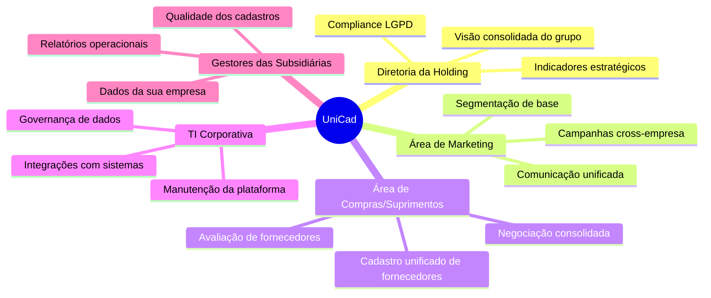

# 4.1 — Descrição do Projeto

## Nome do Projeto

**UniCad — Plataforma Unificada de Cadastros para Holdings**

## Contexto de Negócio

O cenário é o de uma **grande holding empresarial** que administra múltiplas empresas de segmentos variados (varejo, serviços, logística, tecnologia, entre outros). Cada subsidiária opera de forma autônoma há anos, tendo adotado sistemas próprios de gestão — ERPs diferentes, CRMs distintos, planilhas manuais — cada um com seu próprio banco de dados e sua própria estrutura de cadastro de clientes e fornecedores.

O resultado é um ecossistema fragmentado onde:

- A **Empresa A** (varejo) utiliza PostgreSQL e armazena nome, CPF/CNPJ, endereço completo e telefone.
- A **Empresa B** (serviços digitais) utiliza MySQL e armazena nome, e-mail, Instagram e Twitter, mas não coleta endereço.
- A **Empresa C** (indústria) utiliza MongoDB e armazena razão social, CNPJ, contato principal, telefone e certificações.
- A **Empresa D** (operações legadas) mantém cadastros em planilhas Excel com campos inconsistentes.
- A **Empresa E** (startup recente) expõe dados de clientes via API REST em formato JSON.

Nenhuma dessas bases se comunica. Não existe um identificador único entre elas. Os schemas são incompatíveis. Alguns cadastros estão duplicados em diferentes subsidiárias sem que ninguém saiba.

## Problema que o Projeto Pretende Resolver

A holding enfrenta três problemas concretos:

**1. Ausência de visão consolidada.** A diretoria não consegue responder perguntas básicas de governança: "Quantos clientes únicos o grupo atende?", "Quais fornecedores são compartilhados entre subsidiárias?", "Qual o alcance total da nossa base de contatos?"

**2. Impossibilidade de comunicação unificada.** Campanhas de marketing, avisos legais (como LGPD) ou negociações com fornecedores exigem contatar toda a base. Hoje isso requer esforço manual e redundante em cada empresa, sem garantia de cobertura.

**3. Ineficiência operacional e risco de compliance.** Cadastros duplicados, desatualizados ou inconsistentes geram retrabalho, erros de faturamento, falhas em entregas e risco de não conformidade com a LGPD (um mesmo titular de dados aparece em múltiplas bases sem tratamento unificado de consentimento).

Um banco relacional tradicional não resolve o problema porque os schemas são radicalmente diferentes entre as empresas. Uma tabela única teria centenas de colunas, a maioria nula — desperdiçando espaço, prejudicando performance e dificultando a manutenção. A solução exige um modelo flexível que acomode schemas heterogêneos sem perder capacidade de consulta analítica.

## Objetivos Principais

1. **Ingerir** cadastros de clientes e fornecedores de todas as subsidiárias, independentemente do banco de dados ou formato de origem.
2. **Padronizar** os dados em uma estrutura comum, preservando os campos específicos de cada empresa sem forçar um schema rígido.
3. **Deduplicar** registros, identificando o mesmo cliente ou fornecedor que aparece em mais de uma subsidiária.
4. **Disponibilizar** uma visão unificada e consultável (busca por nome, CPF/CNPJ, e-mail, telefone, etc.) através de uma API e de dashboards.
5. **Manter** o sistema atualizado com sincronizações periódicas (batch) e, quando possível, captura de mudanças em tempo próximo ao real (CDC/streaming).

## Principais Stakeholders e Usuários Finais

| Stakeholder | Papel | Necessidade Principal |
|-------------|-------|----------------------|
| Diretoria da Holding | Patrocinador executivo | Visão 360° de clientes e fornecedores do grupo para decisões estratégicas |
| Marketing Corporativo | Usuário final | Base unificada para campanhas de comunicação cross-empresa |
| Compras/Suprimentos | Usuário final | Cadastro consolidado de fornecedores para negociação e avaliação |
| TI Corporativa | Operação e manutenção | Plataforma estável, documentada e extensível para novas subsidiárias |
| Gestores das Subsidiárias | Consumidores e fornecedores de dados | Relatórios de qualidade dos seus cadastros e acesso à visão global |
| DPO / Jurídico | Compliance | Rastreabilidade dos dados pessoais e conformidade com LGPD |
