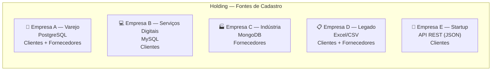
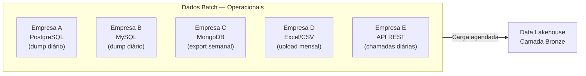
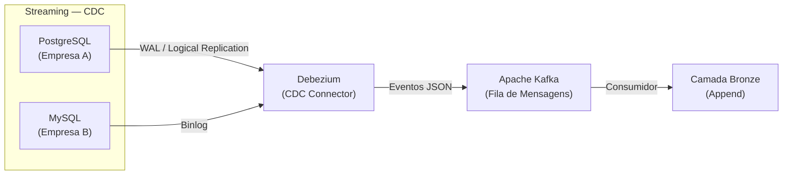

# 4.2 — Definição e Classificação dos Dados

## Visão Geral das Fontes

O projeto UniCad opera sobre cadastros de **clientes** e **fornecedores** distribuídos em 5 subsidiárias, cada uma com seu próprio sistema e estrutura de dados. O quadro abaixo sintetiza as fontes:

## Detalhamento por Fonte

### Empresa A — Rede de Varejo (PostgreSQL)

| Atributo | Detalhe |
|----------|---------|
| **Sistema** | ERP próprio |
| **Banco de dados** | PostgreSQL 15 |
| **Tipo de cadastro** | Clientes (PF e PJ) + Fornecedores |
| **Volume estimado** | ~500.000 clientes, ~2.000 fornecedores |
| **Formato** | Tabelas relacionais normalizadas (3NF) |
| **Campos principais** | `id`, `tipo_pessoa`, `nome_razao_social`, `cpf_cnpj`, `endereco_rua`, `endereco_numero`, `endereco_bairro`, `endereco_cidade`, `endereco_uf`, `endereco_cep`, `telefone_principal`, `email`, `data_cadastro`, `status` |
| **Periodicidade de atualização** | Contínua (sistema transacional ativo) |
| **Latência aceitável** | Sincronização diária (batch) + CDC para alterações críticas |

### Empresa B — Serviços Digitais (MySQL)

| Atributo | Detalhe |
|----------|---------|
| **Sistema** | CRM SaaS customizado |
| **Banco de dados** | MySQL 8 |
| **Tipo de cadastro** | Clientes (majoritariamente PF) |
| **Volume estimado** | ~1.200.000 clientes |
| **Formato** | Tabelas relacionais com desnormalização parcial |
| **Campos principais** | `client_id`, `full_name`, `email`, `phone`, `instagram_handle`, `twitter_handle`, `facebook_url`, `preferred_channel`, `signup_date`, `last_active` |
| **Campos ausentes** | Endereço, CPF (não coletados no cadastro digital) |
| **Periodicidade de atualização** | Contínua |
| **Latência aceitável** | Sincronização diária (batch) |

### Empresa C — Indústria (MongoDB)

| Atributo | Detalhe |
|----------|---------|
| **Sistema** | Sistema de gestão de fornecedores customizado |
| **Banco de dados** | MongoDB 7 |
| **Tipo de cadastro** | Fornecedores (PJ) |
| **Volume estimado** | ~8.000 fornecedores |
| **Formato** | Documentos JSON com schema flexível (nem todos os documentos possuem os mesmos campos) |
| **Campos principais** | `_id`, `razao_social`, `cnpj`, `contato_nome`, `contato_telefone`, `contato_email`, `certificacoes[]`, `categorias[]`, `avaliacao_media`, `endereco{}`, `dados_bancarios{}` |
| **Particularidade** | Campos aninhados (endereço como subdocumento, certificações como array) |
| **Periodicidade de atualização** | Semanal (cadastros novos) + eventual (atualizações) |
| **Latência aceitável** | Semanal (batch) |

### Empresa D — Operações Legadas (Excel/CSV)

| Atributo | Detalhe |
|----------|---------|
| **Sistema** | Planilhas manuais compartilhadas em rede |
| **Banco de dados** | Arquivos `.xlsx` e `.csv` em pastas de rede |
| **Tipo de cadastro** | Clientes + Fornecedores (misturados em abas/arquivos diferentes) |
| **Volume estimado** | ~15.000 clientes, ~500 fornecedores |
| **Formato** | Tabular não padronizado; colunas variam entre planilhas; dados com erros de digitação |
| **Campos principais** | Variáveis — comumente: `Nome`, `CPF ou CNPJ`, `Fone`, `Endereço` (campo único), `Obs` |
| **Particularidade** | Qualidade baixa — campos mesclados (endereço em uma única coluna), valores ausentes, duplicatas frequentes |
| **Periodicidade de atualização** | Irregular (atualização manual mensal ou sob demanda) |
| **Latência aceitável** | Mensal (batch) |

### Empresa E — Startup de Tecnologia (API REST)

| Atributo | Detalhe |
|----------|---------|
| **Sistema** | Plataforma SaaS própria |
| **Banco de dados** | Expõe dados via API REST (backend interno não acessível) |
| **Tipo de cadastro** | Clientes (PF e PJ) |
| **Volume estimado** | ~200.000 clientes |
| **Formato** | JSON via endpoints paginados (`GET /api/v1/customers?page=N`) |
| **Campos principais** | `id`, `name`, `document` (CPF ou CNPJ), `email`, `phone`, `address{}`, `tags[]`, `created_at`, `updated_at` |
| **Particularidade** | API com rate limiting (100 requests/min); dados bem estruturados |
| **Periodicidade de atualização** | Contínua no sistema; ingestão via API diária |
| **Latência aceitável** | Diária (batch via API) |

## Classificação dos Dados

### Dados Operacionais (Batch)

São os dados provenientes de cargas periódicas — a maioria das fontes do UniCad opera nesse modelo.

| Característica | Detalhe |
|----------------|---------|
| **Tipo** | Transacional, histórico, estruturado e semi-estruturado |
| **Padrão** | Full load (carga inicial) + incremental (atualizações subsequentes) |
| **Frequência** | Diária (A, B, E), semanal (C), mensal (D) |
| **Formato na origem** | Tabelas SQL, documentos JSON, CSV/XLSX |
| **Formato na ingestão** | Convertido para Apache Parquet na camada Bronze |

### Dados de Streaming (Eventos em Tempo Real)

Para as fontes que possuem bancos de dados transacionais acessíveis (Empresas A e B), é possível implementar **Change Data Capture (CDC)** para capturar inserções, atualizações e exclusões em tempo próximo ao real.

| Característica | Detalhe |
|----------------|---------|
| **Tipo** | Eventos de mudança (INSERT, UPDATE, DELETE) |
| **Fontes aplicáveis** | Empresa A (PostgreSQL WAL) e Empresa B (MySQL Binlog) |
| **Mecanismo** | Debezium conectado aos logs de transação dos bancos |
| **Transporte** | Apache Kafka como barramento de eventos |
| **Latência** | Segundos a poucos minutos |
| **Formato** | JSON (envelope Debezium: before/after/operation) |
| **Justificativa** | Permite que cadastros críticos (ex.: atualização de CNPJ, mudança de status) reflitam rapidamente na visão unificada, sem esperar o próximo ciclo batch |

### Resumo Comparativo

| Aspecto | Batch | Streaming (CDC) |
|---------|-------|-----------------|
| **Fontes** | Todas (A, B, C, D, E) | A e B apenas |
| **Frequência** | Diária a mensal | Contínua (near real-time) |
| **Volume por ciclo** | Alto (full/incremental dumps) | Baixo (eventos individuais) |
| **Formato de transporte** | Arquivo (Parquet, CSV, JSON) | Evento (JSON via Kafka) |
| **Complexidade** | Baixa | Média-alta (requer Debezium + Kafka) |
| **Caso de uso** | Carga inicial, reconciliação | Atualização rápida de cadastros críticos |

## Volumetria Consolidada

| Fonte | Clientes | Fornecedores | Total Registros | Formato |
|-------|----------|-------------|-----------------|---------|
| Empresa A | 500.000 | 2.000 | 502.000 | SQL (PostgreSQL) |
| Empresa B | 1.200.000 | — | 1.200.000 | SQL (MySQL) |
| Empresa C | — | 8.000 | 8.000 | JSON (MongoDB) |
| Empresa D | 15.000 | 500 | 15.500 | CSV/XLSX |
| Empresa E | 200.000 | — | 200.000 | JSON (API REST) |
| **Total bruto** | **1.915.000** | **10.500** | **~1.925.500** | — |

Após deduplicação na camada Prata, estima-se uma redução de 15–25% no volume de clientes (sobreposição entre subsidiárias), resultando em aproximadamente **1.450.000 a 1.630.000 clientes únicos** e **~9.000 fornecedores únicos**.
