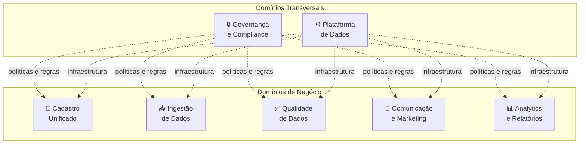
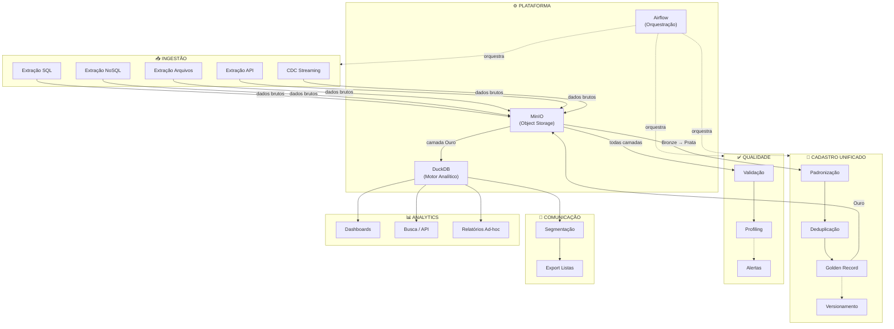

# 4.3 — Domínios e Serviços

## Identificação dos Domínios de Negócio

O UniCad organiza-se em torno de **5 domínios de negócio** e **2 domínios transversais** (compartilhados por todos os demais). Essa divisão segue os princípios de Data Mesh vistos em aula — cada domínio tem responsabilidades claras sobre seus dados, embora a plataforma central de dados seja um serviço compartilhado.

## Domínios e seus Serviços

### 1. Domínio de Ingestão de Dados

**Responsabilidade:** conectar-se às fontes de dados das subsidiárias, extrair cadastros e depositar os dados brutos na camada Bronze do Lakehouse.

| Serviço | Responsabilidade | Fontes Atendidas |
|---------|-----------------|------------------|
| **Serviço de Extração SQL** | Conecta-se a bancos relacionais (PostgreSQL, MySQL) via conectores nativos, executa queries de extração (full e incremental) | Empresas A e B |
| **Serviço de Extração NoSQL** | Conecta-se ao MongoDB via pymongo, exporta coleções em formato JSON | Empresa C |
| **Serviço de Extração de Arquivos** | Lê arquivos CSV/XLSX de diretórios monitorados, valida estrutura mínima e converte para formato intermediário | Empresa D |
| **Serviço de Extração via API** | Consome endpoints REST com paginação e controle de rate limiting, coleta respostas JSON | Empresa E |
| **Serviço de CDC (Streaming)** | Captura eventos de mudança em tempo real dos bancos PostgreSQL e MySQL via Debezium/Kafka | Empresas A e B |

### 2. Domínio de Cadastro Unificado

**Responsabilidade:** é o domínio central do projeto. Transforma dados brutos em um cadastro unificado, padronizado e deduplicado. Opera nas camadas Prata e Ouro do Lakehouse.

| Serviço | Responsabilidade |
|---------|-----------------|
| **Serviço de Padronização** | Mapeia os campos de cada fonte para um schema comum flexível. Normaliza formatos (CPF com/sem pontuação, telefones, endereços). Converte tudo para um modelo de dados unificado |
| **Serviço de Deduplicação** | Identifica registros que representam o mesmo cliente ou fornecedor em diferentes subsidiárias. Usa regras de matching (CPF/CNPJ exato, similaridade de nome + e-mail, fuzzy matching) |
| **Serviço de Merge/Golden Record** | Para cada entidade deduplicada, gera um "registro dourado" que consolida as melhores informações de cada fonte (ex.: endereço da Empresa A + Instagram da Empresa B) |
| **Serviço de Versionamento** | Mantém histórico de alterações em cada cadastro (Slowly Changing Dimension tipo 2) para rastreabilidade |

### 3. Domínio de Qualidade de Dados

**Responsabilidade:** monitorar, medir e reportar a qualidade dos dados em todas as camadas.

| Serviço | Responsabilidade |
|---------|-----------------|
| **Serviço de Validação** | Aplica regras de validação (CPF/CNPJ válido, e-mail com formato correto, telefone com DDD, campos obrigatórios preenchidos) |
| **Serviço de Profiling** | Gera estatísticas sobre completude, unicidade e consistência dos dados por fonte e por camada |
| **Serviço de Alertas de Qualidade** | Notifica a equipe quando indicadores de qualidade caem abaixo de limiares definidos (ex.: taxa de nulidade de e-mail > 40%) |

### 4. Domínio de Comunicação e Marketing

**Responsabilidade:** consumir a visão unificada para viabilizar comunicação com clientes e fornecedores.

| Serviço | Responsabilidade |
|---------|-----------------|
| **Serviço de Segmentação** | Permite criar segmentos de público (ex.: todos os clientes com e-mail, todos os fornecedores de SP, clientes ativos em mais de uma subsidiária) |
| **Serviço de Exportação de Listas** | Gera listas de contatos em formatos consumíveis (CSV, JSON) para alimentar ferramentas de e-mail marketing ou CRM corporativo |

### 5. Domínio de Analytics e Relatórios

**Responsabilidade:** disponibilizar dados para análise estratégica e operacional.

| Serviço | Responsabilidade |
|---------|-----------------|
| **Serviço de Dashboards** | Painéis visuais com indicadores-chave: total de cadastros unificados, distribuição por subsidiária, cobertura de campos, taxa de deduplicação |
| **Serviço de Busca** | API de consulta que permite buscar clientes/fornecedores por qualquer campo disponível (nome, CPF/CNPJ, e-mail, telefone, cidade) |
| **Serviço de Relatórios Ad-hoc** | Consultas SQL diretas no DuckDB para análises pontuais da diretoria ou auditoria |

### 6. Domínio Transversal — Governança e Compliance

**Responsabilidade:** garantir conformidade legal (LGPD) e aplicar políticas de acesso e uso dos dados.

| Serviço | Responsabilidade |
|---------|-----------------|
| **Serviço de Catálogo de Dados** | Documenta metadados de todas as fontes, campos, transformações e linhagem (data lineage) |
| **Serviço de Controle de Acesso** | Define quem pode ver quais dados (ex.: gestores de subsidiária veem apenas seus cadastros; diretoria vê tudo) |
| **Serviço de LGPD** | Rastreabilidade de dados pessoais; mecanismo para atender pedidos de exclusão e portabilidade |

### 7. Domínio Transversal — Plataforma de Dados

**Responsabilidade:** prover a infraestrutura compartilhada que todos os domínios utilizam.

| Serviço | Responsabilidade |
|---------|-----------------|
| **Serviço de Object Storage** | Armazena todos os arquivos Parquet das camadas Bronze/Prata/Ouro (MinIO) |
| **Serviço de Motor Analítico** | DuckDB como motor de consulta sobre os arquivos Parquet |
| **Serviço de Orquestração** | Apache Airflow para agendar e monitorar pipelines |
| **Serviço de Monitoramento** | Logs, métricas e alertas da plataforma (health checks, falhas de pipeline) |

## Diagrama de Domínios, Serviços e Interações

## Serviços Compartilhados entre Domínios

Alguns serviços são consumidos por múltiplos domínios:

| Serviço Compartilhado | Domínios que Consomem |
|------------------------|----------------------|
| MinIO (Object Storage) | Ingestão, Cadastro Unificado, Qualidade, Analytics |
| DuckDB (Motor Analítico) | Cadastro Unificado, Analytics, Comunicação |
| Airflow (Orquestração) | Ingestão, Cadastro Unificado, Qualidade |
| Catálogo de Dados | Todos os domínios |
| Controle de Acesso | Analytics, Comunicação, Cadastro Unificado |
