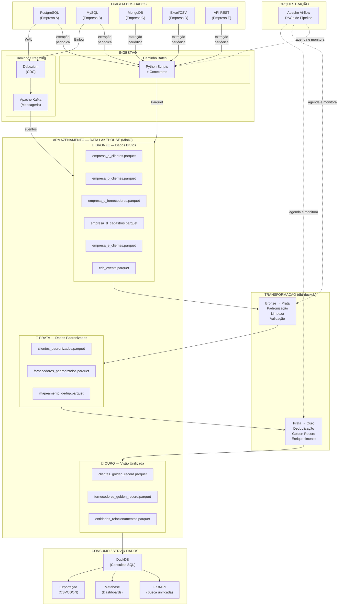
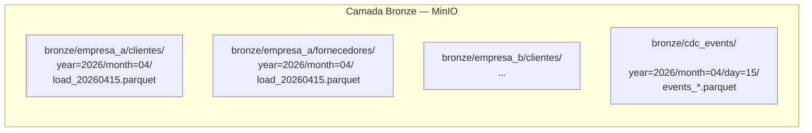
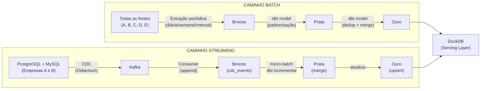

# 4.4 — Arquitetura — O que Será Feito (Fluxo de Dados)

## Tipo de Arquitetura Escolhida

O UniCad adota uma arquitetura **Data Lakehouse com Arquitetura Medalhão (Bronze/Prata/Ouro)**, complementada por uma camada de **streaming via Lambda Architecture** para as fontes que suportam CDC.

### Justificativa da escolha (com base nos conceitos das Aulas 02 e 03)

**Por que Lakehouse e não Data Warehouse puro?**
Um Data Warehouse tradicional (Inmon/Kimball) pressupõe schema rígido e dados estruturados. O UniCad lida com schemas radicalmente diferentes entre subsidiárias — campos que existem em uma fonte e não existem em outra. O Lakehouse permite armazenar dados semi-estruturados em formato aberto (Parquet) no object storage, mantendo a flexibilidade de um Data Lake com a capacidade analítica de um Data Warehouse. Conforme discutido na Aula 03, o Lakehouse é a convergência dessas duas abordagens.

**Por que não Data Lake puro?**
O Data Lake 1.0 sofre do problema de "data swamp" — dados sem organização nem governança. A Arquitetura Medalhão (Bronze/Prata/Ouro) resolve isso ao impor camadas de qualidade progressiva, com transformações claras entre cada etapa. Isso garante que o dado bruto é preservado (Bronze) mas o dado consumido é limpo e confiável (Ouro).

**Por que elementos de Lambda Architecture?**
O projeto combina dois caminhos: batch (carga periódica de todas as fontes) e streaming (CDC para PostgreSQL e MySQL). Isso se alinha com a Lambda Architecture (Aula 03), que propõe uma batch layer e uma speed layer convergindo em uma serving layer. No UniCad, a camada Ouro com DuckDB funciona como serving layer, alimentada tanto pelo pipeline batch quanto pelo pipeline de streaming.

**Por que não Kappa Architecture?**
A Kappa Architecture propõe tratar tudo como streaming. Isso seria inviável no contexto do UniCad porque três das cinco fontes (MongoDB, Excel/CSV e API REST) não emitem eventos em tempo real — são fontes naturalmente batch. Forçar essas fontes em um paradigma de streaming adicionaria complexidade sem benefício.

**Elementos de Data Mesh:**
Embora não seja uma implementação completa de Data Mesh, o projeto adota o princípio de **domínios com responsabilidades claras** sobre seus dados (conforme Aula 03). Cada domínio definido na seção 4.3 é responsável pela qualidade e transformação dos dados sob sua gestão. A plataforma de dados (MinIO + DuckDB + Airflow) funciona como a **infraestrutura self-service** que o Data Mesh preconiza.

## Diagrama da Arquitetura — Fluxo Ponta a Ponta



## Detalhamento das Camadas do Medalhão

### Camada Bronze — Dados Brutos

A camada Bronze é o ponto de aterrissagem dos dados. Os dados são armazenados no formato mais fiel possível à origem, convertidos para Parquet para eficiência de armazenamento, mas sem alterações de conteúdo.



| Aspecto | Detalhe |
|---------|---------|
| **Formato** | Apache Parquet (colunar, comprimido) |
| **Organização** | Particionado por `empresa/tipo_cadastro/ano/mês` |
| **Schema** | Cada fonte mantém seu schema original (colunas diferentes por empresa) |
| **Metadados adicionados** | `_source` (empresa de origem), `_ingested_at` (timestamp da ingestão), `_batch_id` (identificador do lote) |
| **Retenção** | Permanente (dados brutos nunca são deletados — princípio de imutabilidade) |
| **Propósito** | Auditoria, reprocessamento, data lineage |

### Camada Prata — Dados Padronizados

A camada Prata aplica as transformações de padronização e limpeza. Todos os schemas heterogêneos são mapeados para um **modelo comum flexível**.

O modelo na Prata utiliza uma abordagem híbrida: campos universais (presentes em todas ou quase todas as fontes) ficam como colunas fixas, e campos específicos de cada empresa ficam em uma coluna `atributos_extras` do tipo JSON/MAP.

```
Schema Prata — clientes_padronizados:
├── id_unicad (UUID gerado)
├── fonte (empresa de origem)
├── id_origem (ID no sistema de origem)
├── tipo_pessoa (PF | PJ)
├── nome_razao_social (padronizado)
├── cpf_cnpj (limpo, sem pontuação)
├── email (lowercase, validado)
├── telefone_principal (formato E.164)
├── cidade
├── uf
├── atributos_extras (MAP<STRING, STRING>)
│   ├── "instagram" → "@fulano"
│   ├── "endereco_completo" → "Rua X, 123, Bairro Y"
│   ├── "certificacoes" → "ISO9001, ISO14001"
│   └── ... (qualquer campo específico da fonte)
├── _source
├── _ingested_at
└── _processed_at
```

| Aspecto | Detalhe |
|---------|---------|
| **Transformações** | Normalização de CPF/CNPJ, padronização de telefones (E.164), lowercase em e-mails, parsing de endereços, mapeamento de campos por fonte |
| **Validações** | CPF/CNPJ com dígito verificador, formato de e-mail, telefone com DDD válido |
| **Campos flexíveis** | Coluna `atributos_extras` (MAP/JSON) acomoda qualquer campo específico sem gerar colunas vazias |
| **Propósito** | Dado limpo e padronizado, pronto para deduplicação |

### Camada Ouro — Visão Unificada (Golden Record)

A camada Ouro contém o resultado final: cada cliente ou fornecedor como uma **entidade única** (Golden Record), consolidando as melhores informações de todas as fontes.

```
Schema Ouro — clientes_golden_record:
├── id_golden (UUID)
├── tipo_pessoa (PF | PJ)
├── nome_razao_social (melhor versão disponível)
├── cpf_cnpj
├── emails[] (todos os e-mails conhecidos)
├── telefones[] (todos os telefones conhecidos)
├── enderecos[] (todos os endereços conhecidos)
├── redes_sociais (MAP<STRING, STRING>)
├── fontes[] (lista de empresas onde aparece)
├── ids_origem (MAP<STRING, STRING>) — ex.: {"empresa_a": "12345", "empresa_b": "A-789"}
├── atributos_consolidados (MAP<STRING, STRING>)
├── score_completude (0.0 a 1.0)
├── total_fontes (INT)
├── primeira_aparicao (DATE)
├── ultima_atualizacao (TIMESTAMP)
└── versao (INT — SCD Type 2)
```

| Aspecto | Detalhe |
|---------|---------|
| **Deduplicação** | Matching por CPF/CNPJ (exato), depois por nome + e-mail (fuzzy), depois por nome + telefone (fuzzy) |
| **Golden Record** | Para cada campo, prioriza a fonte mais completa e mais recente |
| **Arrays e Maps** | Campos como `emails[]` e `telefones[]` acumulam todos os valores conhecidos (não perdem informação) |
| **Score de completude** | Métrica de 0 a 1 que indica quão completo é o cadastro (quantos campos preenchidos / total possível) |
| **Formato** | Parquet colunar — ideal para DuckDB consultar diretamente |

## Caminhos Batch e Streaming



**Batch:** é o caminho principal. Todas as 5 fontes passam por extração periódica (frequência definida na seção 4.2), conversão para Parquet e deposit na Bronze. O Airflow orquestra as DAGs de transformação Bronze→Prata→Ouro via dbt-duckdb.

**Streaming:** é complementar. Apenas as Empresas A (PostgreSQL) e B (MySQL) possuem bancos transacionais com suporte a CDC. O Debezium captura eventos do WAL/Binlog, publica no Kafka, e um consumidor deposita na Bronze como append. Periodicamente (a cada poucos minutos), um modelo dbt incremental processa esses eventos e atualiza as camadas Prata e Ouro.

## Trade-offs Arquiteturais

### Acoplamento

| Decisão | Análise |
|---------|---------|
| **Fontes desacopladas do Lakehouse** | Cada conector de ingestão é independente. Adicionar uma nova subsidiária significa criar um novo script/conector sem alterar o restante do pipeline. Isso segue o princípio de **acoplamento fraco** (Aula 02). |
| **Formato aberto (Parquet)** | Não gera lock-in com nenhum motor de processamento. DuckDB, Spark, Pandas — qualquer ferramenta lê Parquet. Decisão **reversível** (conceito de "portas de duas vias", Aula 02). |
| **dbt como camada de transformação** | Os modelos SQL do dbt são declarativos e portáveis. Se o motor analítico mudar de DuckDB para outro, os modelos SQL requerem ajustes mínimos. |

### Escalabilidade

| Dimensão | Situação Atual | Caminho de Crescimento |
|----------|---------------|----------------------|
| **Volume** | ~2M registros — cabe facilmente em DuckDB local | DuckDB suporta dezenas de GB em disco sem problemas. Para TB+, migrar para MotherDuck (DuckDB na nuvem) ou Spark |
| **Fontes** | 5 subsidiárias | Adicionar nova fonte = novo conector + novo modelo dbt Bronze→Prata. Sem impacto no restante |
| **Frequência** | Batch diário/semanal + CDC near real-time | Escalar streaming adicionando mais tópicos Kafka e consumers |

### Disponibilidade e Confiabilidade

| Aspecto | Abordagem |
|---------|-----------|
| **Imutabilidade da Bronze** | Dados brutos nunca são sobrescritos; cada ingestão cria novos arquivos particionados. Em caso de erro na transformação, basta reprocessar a partir da Bronze |
| **Idempotência** | Pipelines dbt são idempotentes — executar duas vezes produz o mesmo resultado. Eventos CDC possuem offset no Kafka para reprocessamento |
| **Recuperação** | Se uma DAG do Airflow falha, o retry é automático. A camada Ouro anterior permanece disponível até a nova ser computada com sucesso |

### Reversibilidade das Decisões

| Decisão | Reversibilidade |
|---------|----------------|
| DuckDB como motor analítico | **Alta.** Dados estão em Parquet no MinIO. Trocar DuckDB por Spark, Trino ou BigQuery exige apenas apontar o novo motor para os mesmos arquivos |
| MinIO como object storage | **Alta.** API compatível com S3. Migrar para AWS S3 ou GCS requer apenas trocar endpoint |
| Parquet como formato | **Alta.** Formato aberto, padrão da indústria. Aceito por qualquer ferramenta moderna |
| Debezium + Kafka para CDC | **Média.** Substituir Debezium por outro conector CDC é possível, mas requer reconfiguração do pipeline de streaming |
| Arquitetura Medalhão | **Alta.** As camadas são convenções lógicas sobre pastas do MinIO. Reorganizar camadas não exige migração de infraestrutura |
