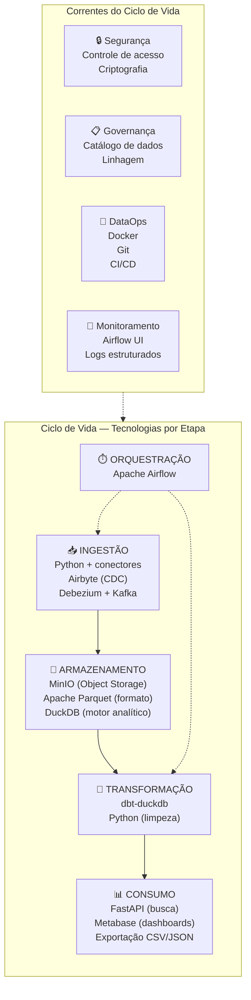
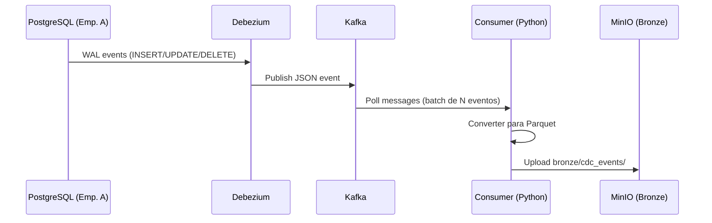
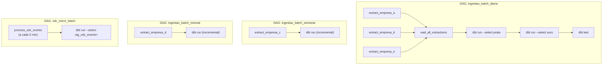

# 4.5 — Tecnologias — Como Será Feito

## Visão Geral do Stack Tecnológico



## 1. Ingestão

### 1.1 Python + Conectores Nativos (Batch)

**Tecnologia:** Python 3.11+ com bibliotecas de conexão a bancos de dados.

**Justificativa:** Python é a linguagem mais utilizada em engenharia de dados pela riqueza de bibliotecas para conectar-se a praticamente qualquer fonte. Para o UniCad, que precisa extrair dados de 5 fontes heterogêneas, Python permite escrever conectores leves e específicos para cada uma, sem a necessidade de um framework pesado. Em um ambiente acadêmico com recursos limitados de máquina, scripts Python são leves e suficientes para o volume de dados (~2M registros).

| Fonte | Biblioteca Python | Método de Extração |
|-------|------------------|--------------------|
| Empresa A (PostgreSQL) | `psycopg2` | Query SQL com filtro incremental (`WHERE updated_at > last_run`) |
| Empresa B (MySQL) | `mysql-connector-python` | Query SQL com filtro incremental |
| Empresa C (MongoDB) | `pymongo` | `find()` com filtro por `_id` ou data de modificação |
| Empresa D (Excel/CSV) | `pandas` + `openpyxl` | Leitura de arquivos em diretório monitorado |
| Empresa E (API REST) | `requests` | GET paginado com controle de rate limit (`time.sleep`) |

Todos os conectores convertem o resultado para **Apache Parquet** via `pyarrow` antes de depositar no MinIO. Isso garante formato uniforme na camada Bronze.

### 1.2 Debezium + Apache Kafka (Streaming/CDC)

**Tecnologia:** Debezium 2.x (conector CDC) + Apache Kafka 3.x (barramento de eventos).

**Justificativa:** Para manter a visão unificada atualizada entre os ciclos batch, as Empresas A e B (que possuem bancos transacionais acessíveis) utilizam Change Data Capture. O Debezium é o padrão open-source para CDC — ele lê os logs de transação do banco (WAL no PostgreSQL, Binlog no MySQL) e publica eventos de mudança (INSERT, UPDATE, DELETE) como mensagens JSON no Kafka. O Kafka funciona como barramento durável e desacoplado: o producer (Debezium) e o consumer (script Python que grava na Bronze) operam de forma independente.

**Alternativa considerada:** Airbyte, que oferece CDC integrado com interface visual. No entanto, o Debezium + Kafka oferece menor latência e maior controle sobre o pipeline de streaming, além de ser mais leve em recursos quando operado via Docker.

**Integração:** Um consumidor Kafka (Python com `confluent-kafka`) lê os eventos, converte para Parquet e deposita na Bronze em partições temporais (`cdc_events/year=YYYY/month=MM/day=DD/`).



## 2. Armazenamento

### 2.1 MinIO (Object Storage)

**Tecnologia:** MinIO — object storage compatível com a API do Amazon S3, open-source e auto-hospedado.

**Justificativa:** O MinIO simula localmente o serviço S3 da AWS, que é o padrão da indústria para armazenamento de dados em Data Lakes e Lakehouses. Toda a arquitetura Medalhão (Bronze/Prata/Ouro) é implementada como estrutura de pastas (buckets e prefixos) dentro do MinIO. A escolha do MinIO em vez de S3 real atende ao requisito acadêmico de viabilidade em máquina local — o MinIO roda como um único container Docker consumindo poucos recursos.

**Estrutura de buckets:**

```
lakehouse/
├── bronze/
│   ├── empresa_a/clientes/year=2026/month=04/
│   ├── empresa_a/fornecedores/year=2026/month=04/
│   ├── empresa_b/clientes/year=2026/month=04/
│   ├── empresa_c/fornecedores/year=2026/month=04/
│   ├── empresa_d/cadastros/year=2026/month=04/
│   ├── empresa_e/clientes/year=2026/month=04/
│   └── cdc_events/year=2026/month=04/day=15/
├── prata/
│   ├── clientes_padronizados/
│   └── fornecedores_padronizados/
└── ouro/
    ├── clientes_golden_record/
    ├── fornecedores_golden_record/
    └── metricas_qualidade/
```

**Reversibilidade:** como a API é 100% compatível com S3, migrar para AWS S3, Google Cloud Storage ou Azure Blob Storage requer apenas trocar o endpoint e as credenciais — zero alteração no código dos pipelines.

### 2.2 Apache Parquet (Formato de Armazenamento)

**Tecnologia:** Apache Parquet — formato colunar binário, comprimido e open-source.

**Justificativa:** O Parquet é o formato ideal para o UniCad por três razões. Primeiro, como formato **colunar**, ele comprime eficientemente colunas com muitos valores nulos — exatamente o problema dos cadastros heterogêneos onde a maioria dos campos existe apenas para algumas fontes. Segundo, suporta **schema evolution** — se uma nova subsidiária trouxer campos novos, o Parquet acomoda sem quebrar os arquivos existentes. Terceiro, é o formato nativo do DuckDB — consultas analíticas sobre Parquet no DuckDB são extremamente rápidas, com leitura apenas das colunas necessárias (column pruning) e filtragem na leitura (predicate pushdown).

**Compressão:** Snappy (padrão) — oferece bom equilíbrio entre taxa de compressão e velocidade de leitura/escrita, conforme discutido na Aula 04 sobre o trade-off entre CPU e espaço/velocidade.

### 2.3 DuckDB (Motor Analítico)

**Tecnologia:** DuckDB 1.x — banco de dados analítico (OLAP) embarcado, colunar e open-source.

**Justificativa:** O DuckDB é a peça central da serving layer do UniCad. A escolha sobre um banco relacional tradicional (PostgreSQL, MySQL) se justifica pelo cenário:

1. **Colunar por natureza.** O problema fundamental do projeto é que um banco relacional geraria tabelas com centenas de colunas majoritariamente nulas. O DuckDB armazena dados por coluna — colunas com muitos nulos ocupam espaço mínimo (a compressão colunar praticamente elimina o custo de colunas esparsas). Conforme discutido na Aula 04, bancos colunares são superiores para leitura analítica sobre dados com muitas colunas.

2. **Consulta direta sobre Parquet.** O DuckDB lê arquivos Parquet do MinIO (via extensão `httpfs`) sem necessidade de ingestão prévia. A camada Ouro inteira pode ser consultada com SQL padrão diretamente sobre os arquivos no object storage.

3. **Leve e embarcado.** Não requer servidor separado — roda como biblioteca dentro de um processo Python ou como CLI. Ideal para ambiente acadêmico com recursos limitados.

4. **Suporte a tipos complexos.** DuckDB suporta nativamente `LIST`, `MAP` e `STRUCT` — perfeito para colunas como `emails[]`, `telefones[]`, `atributos_extras(MAP)` que o UniCad utiliza no Golden Record.

5. **Desempenho OLAP.** Para consultas analíticas (agregações, buscas, relatórios), DuckDB é ordens de magnitude mais rápido que bancos OLTP como PostgreSQL, graças ao processamento vetorial colunar.

**Alternativa considerada:** MongoDB (orientado a documentos, flexível com JSON). Foi descartado porque o DuckDB oferece melhor desempenho analítico (buscas, agregações, joins) e integração nativa com Parquet, enquanto o MongoDB seria mais adequado se o caso de uso fosse operacional (muitas escritas individuais), não analítico.

## 3. Processamento e Transformação

### 3.1 dbt-duckdb

**Tecnologia:** dbt-core com adaptador dbt-duckdb — framework de transformação SQL declarativo.

**Justificativa:** O dbt (data build tool) permite escrever as transformações Bronze→Prata→Ouro como **modelos SQL versionados, testáveis e documentados**. Cada transformação é um arquivo `.sql` que descreve o que deve ser feito (declarativo), e o dbt cuida de executar na ordem correta (DAG de dependências). O adaptador `dbt-duckdb` executa os modelos diretamente no DuckDB, lendo e escrevendo Parquet no MinIO.

**Vantagens para o projeto:**

- **Testabilidade:** dbt possui testes nativos (`unique`, `not_null`, `accepted_values`, `relationships`) que garantem qualidade dos dados entre camadas.
- **Documentação automática:** gera catálogo de dados navegável (data lineage, descrições de campos).
- **Materialização flexível:** modelos podem ser tabelas (reescritas a cada execução) ou incrementais (processam apenas dados novos — essencial para o CDC).
- **Versionamento:** modelos SQL versionados no Git junto com o restante do projeto.

**Modelos planejados:**

```
models/
├── bronze/          (sources — apenas referências às tabelas brutas)
├── prata/
│   ├── stg_empresa_a_clientes.sql    (padronização da Empresa A)
│   ├── stg_empresa_b_clientes.sql    (padronização da Empresa B)
│   ├── stg_empresa_c_fornecedores.sql
│   ├── stg_empresa_d_cadastros.sql
│   ├── stg_empresa_e_clientes.sql
│   ├── stg_cdc_events.sql            (processamento de eventos CDC)
│   ├── int_clientes_padronizados.sql (union de todos os clientes)
│   └── int_fornecedores_padronizados.sql
└── ouro/
    ├── golden_clientes.sql           (deduplicação + merge)
    ├── golden_fornecedores.sql
    └── metricas_qualidade.sql        (scores de completude)
```

### 3.2 Python para Limpeza Especializada

**Tecnologia:** Python com `pandas`, `unidecode`, `validate-docbr` (validação CPF/CNPJ).

**Justificativa:** Algumas transformações exigem lógica que vai além do SQL — fuzzy matching para deduplicação (biblioteca `thefuzz`), validação de CPF/CNPJ com dígito verificador, normalização de endereços. Essas funções são implementadas como **UDFs (User Defined Functions)** registradas no DuckDB ou como scripts pré-processamento invocados pelo Airflow antes dos modelos dbt.

## 4. Orquestração

### 4.1 Apache Airflow

**Tecnologia:** Apache Airflow 2.x — plataforma de orquestração de workflows.

**Justificativa:** O Airflow é o orquestrador mais utilizado em engenharia de dados, e sua escolha se justifica pela necessidade de agendar, monitorar e gerenciar dependências entre múltiplas etapas do pipeline (ingestão de 5 fontes → transformação Bronze→Prata→Ouro → atualização da serving layer). O Airflow permite definir DAGs (grafos acíclicos direcionados) em Python, com retry automático em caso de falha, alertas e interface web para monitoramento.

**DAGs planejadas:**



**Alternativa considerada:** Dagster e Prefect. O Airflow foi escolhido por ser o mais estabelecido, com maior comunidade e documentação, e por já estar coberto na ementa da disciplina. Dagster oferece vantagens em testabilidade, mas a curva de aprendizado adicional não se justifica para o escopo do projeto.

## 5. Servir Dados / Consumo

### 5.1 FastAPI (API de Busca)

**Tecnologia:** FastAPI — framework web Python de alta performance.

**Justificativa:** O UniCad precisa de uma interface de busca para que os stakeholders consultem o cadastro unificado por qualquer campo (nome, CPF/CNPJ, e-mail, telefone, cidade). FastAPI permite construir endpoints REST com validação automática, documentação Swagger/OpenAPI integrada, e alta performance com execução assíncrona. O backend conecta diretamente ao DuckDB para executar as queries.

**Endpoints planejados:**

| Endpoint | Método | Função |
|----------|--------|--------|
| `/api/v1/clientes/buscar` | GET | Busca por nome, CPF/CNPJ, e-mail, telefone, cidade |
| `/api/v1/fornecedores/buscar` | GET | Busca por razão social, CNPJ, categoria |
| `/api/v1/entidade/{id}` | GET | Detalhes completos de um Golden Record |
| `/api/v1/exportar` | POST | Gera CSV/JSON filtrado para download |
| `/api/v1/metricas/qualidade` | GET | Indicadores de qualidade e completude |

### 5.2 Metabase (Dashboards)

**Tecnologia:** Metabase — plataforma de BI open-source.

**Justificativa:** Para visualização de indicadores estratégicos (total de cadastros, distribuição por subsidiária, cobertura de campos, taxa de deduplicação), o Metabase oferece uma interface intuitiva que não requer conhecimento de SQL por parte dos usuários de negócio. Conecta-se ao DuckDB e permite criar dashboards interativos. Foi escolhido sobre o Power BI por ser open-source e viável em ambiente Docker local.

### 5.3 Exportação CSV/JSON

**Tecnologia:** Endpoint da FastAPI + scripts Python com `pandas`.

**Justificativa:** A área de Marketing e Comunicação precisa exportar listas segmentadas de contatos para ferramentas externas (e-mail marketing, CRM). A exportação é feita via API (endpoint `/exportar`) ou scripts agendados no Airflow que geram arquivos em diretórios do MinIO.

## 6. Correntes do Ciclo de Vida

### 6.1 Segurança

| Aspecto | Implementação |
|---------|---------------|
| **Acesso ao MinIO** | Credenciais por IAM policies; buckets com ACLs |
| **Acesso ao DuckDB** | Controle via aplicação (FastAPI com autenticação JWT) |
| **Dados sensíveis** | CPF/CNPJ e dados pessoais seguem LGPD; criptografia em repouso no MinIO |
| **Rede** | Todos os serviços em rede Docker interna; apenas FastAPI e Metabase expostos |

### 6.2 Governança de Dados

| Aspecto | Implementação |
|---------|---------------|
| **Catálogo de dados** | dbt docs (gerado automaticamente com descrições dos modelos e campos) |
| **Data lineage** | dbt gera o grafo de dependências entre fontes, modelos intermediários e tabelas finais |
| **Metadados** | Cada registro carrega `_source`, `_ingested_at`, `_processed_at` para rastreabilidade completa |

### 6.3 DataOps

| Aspecto | Implementação |
|---------|---------------|
| **Conteinerização** | Todos os serviços orquestrados via `docker-compose` (MinIO, Kafka, Airflow, Metabase) |
| **Versionamento** | Código, modelos dbt e configurações versionados no Git/GitHub |
| **CI/CD** | GitHub Actions para executar `dbt test` a cada push (validação dos modelos) |
| **Reprodutibilidade** | `docker-compose up` reproduz o ambiente completo em qualquer máquina |

### 6.4 Monitoramento

| Aspecto | Implementação |
|---------|---------------|
| **Pipelines** | Airflow UI — status de cada DAG run, logs de tasks, alertas de falha |
| **Qualidade** | Modelo dbt `metricas_qualidade.sql` calcula scores e tendências a cada execução |
| **Infraestrutura** | Logs Docker + healthchecks nos containers |

## Resumo: Tecnologia por Etapa

| Etapa do Ciclo | Tecnologia | Licença | Execução |
|----------------|-----------|---------|----------|
| Ingestão (batch) | Python + psycopg2/mysql-connector/pymongo/pandas/requests | Open-source | Container Docker |
| Ingestão (streaming) | Debezium + Apache Kafka | Open-source | Containers Docker |
| Armazenamento (object) | MinIO | Open-source (AGPL) | Container Docker |
| Armazenamento (formato) | Apache Parquet | Open-source (Apache 2.0) | Formato de arquivo |
| Armazenamento (motor) | DuckDB | Open-source (MIT) | Embarcado (processo Python) |
| Transformação | dbt-duckdb + Python | Open-source | Container Docker |
| Orquestração | Apache Airflow | Open-source (Apache 2.0) | Container Docker |
| Consumo (API) | FastAPI | Open-source (MIT) | Container Docker |
| Consumo (BI) | Metabase | Open-source (AGPL) | Container Docker |
| DataOps | Docker + Docker Compose + Git | Open-source | Local |
