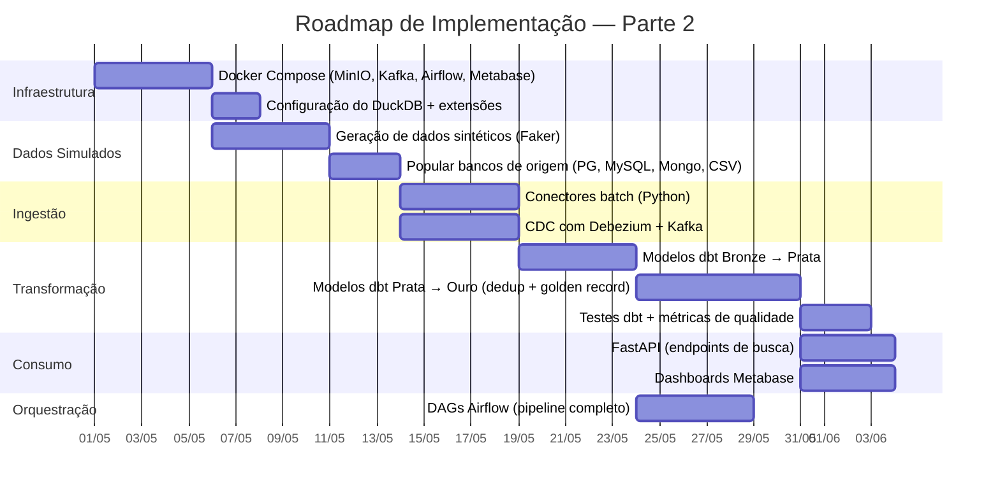

# 4.6 — Considerações Finais

## Principais Riscos e Limitações

### Riscos Técnicos

| Risco | Probabilidade | Impacto | Mitigação |
|-------|:------------:|:-------:|-----------|
| **Qualidade dos dados legados (Empresa D)** | Alta | Alto | As planilhas Excel possuem dados inconsistentes, campos mesclados e erros de digitação. A camada Prata precisa de regras robustas de limpeza. Planeja-se investir tempo significativo em scripts de parsing e normalização para essa fonte específica. |
| **Complexidade da deduplicação** | Média | Alto | Matching por CPF/CNPJ é determinístico, mas nem todos os cadastros possuem esse campo (ex.: Empresa B não coleta CPF). O fuzzy matching por nome + e-mail pode gerar falsos positivos. Será necessário definir thresholds cuidadosos e validação manual de amostras. |
| **Recursos de máquina limitados** | Média | Médio | Rodar MinIO + Kafka + Airflow + Metabase em Docker simultaneamente exige pelo menos 8 GB de RAM e bom SSD. Em máquinas com menos recursos, pode ser necessário subir os serviços em etapas ou reduzir o volume de dados simulados. |
| **Latência do CDC** | Baixa | Baixo | O Debezium + Kafka introduz complexidade operacional. Se o CDC se mostrar inviável na máquina disponível, pode ser substituído por ingestão incremental batch com maior frequência (a cada 15 minutos em vez de diária), mantendo a arquitetura funcional. |

### Limitações do Escopo

| Limitação | Justificativa |
|-----------|---------------|
| **Dados simulados** | Não teremos acesso a sistemas reais de subsidiárias. Os dados serão gerados sinteticamente (Faker, scripts Python) com schemas realistas para cada empresa. |
| **Escala reduzida** | O volume de ~2M registros é representativo do cenário, mas a implementação local não testará escalabilidade real para dezenas de milhões de registros. |
| **Sem autenticação real** | O controle de acesso na FastAPI será simplificado (token fixo ou basic auth) — uma implementação completa com SSO/OIDC está fora do escopo. |
| **LGPD conceitual** | Os mecanismos de compliance LGPD (exclusão, portabilidade) serão descritos na documentação, mas a implementação funcional completa fica para a Parte 2 ou como extensão futura. |
| **Streaming simplificado** | Se os recursos da máquina não suportarem Kafka + Debezium, o caminho de streaming será demonstrado conceitualmente e substituído por micro-batch no protótipo. |

## Alinhamento com os Conceitos das Aulas

| Conceito da Disciplina | Onde foi aplicado no UniCad |
|------------------------|----------------------------|
| Pirâmide Informacional (Aula 01) | Dados brutos (Bronze) → informação padronizada (Prata) → conhecimento consolidado (Ouro) → inteligência para decisão (dashboards) |
| Princípios de Arquitetura (Aula 02) | Acoplamento fraco (fontes independentes), reversibilidade (formato aberto Parquet), escalabilidade (DuckDB → MotherDuck), FinOps (100% open-source) |
| Data Lakehouse + Medalhão (Aula 03) | Arquitetura principal do projeto — convergência Lake + Warehouse com camadas Bronze/Prata/Ouro |
| Lambda Architecture (Aula 03) | Combinação de batch layer (ingestão periódica de todas as fontes) com speed layer (CDC para Empresas A e B) |
| Data Mesh — princípios (Aula 03) | Domínios com responsabilidades claras, plataforma self-service (MinIO + DuckDB + Airflow) |
| Armazenamento colunar (Aula 04) | DuckDB + Parquet — compressão eficiente de colunas esparsas, predicate pushdown, column pruning |
| Serialização — Parquet (Aula 04) | Formato colunar binário como formato padrão de todo o Lakehouse |
| Compressão (Aula 04) | Snappy no Parquet — trade-off velocidade vs espaço |
| Modelagem — schema flexível (Aula 05) | Modelo híbrido: colunas fixas + MAP/JSON para campos extras, evitando tabela relacional esparsa |
| Normalização → Desnormalização (Aula 05) | Bronze recebe dados normalizados (3NF das fontes SQL); Ouro entrega desnormalizado (Golden Record com arrays e maps) para performance analítica |
| Arquitetura Medalhão (Aula 05) | Implementação direta: Bronze (bruto, imutável), Prata (limpo, padronizado), Ouro (unificado, pronto para consumo) |

## Próximos Passos para a Parte 2 (Implementação)

A Parte 2 do projeto consiste na implementação prática do que foi planejado neste documento. O roadmap de implementação segue a ordem natural do ciclo de vida dos dados:

### Prioridades da implementação

**Prioridade 1 — MVP funcional:** infraestrutura Docker, geração de dados sintéticos, ingestão batch de pelo menos 3 fontes (PostgreSQL, MySQL, CSV), modelos dbt Bronze→Prata→Ouro com deduplicação básica por CPF/CNPJ, e consulta no DuckDB.

**Prioridade 2 — Consumo:** FastAPI com endpoint de busca e pelo menos um dashboard no Metabase mostrando indicadores do cadastro unificado.

**Prioridade 3 — Complementar:** CDC/streaming, fuzzy matching na deduplicação, DAGs completas no Airflow, métricas de qualidade, ingestão das 5 fontes.

## Conclusão

O UniCad demonstra como os conceitos de engenharia de dados — desde fundamentos de armazenamento até padrões arquiteturais modernos — se aplicam a um problema real de negócio. A escolha de um stack 100% open-source e executável localmente garante viabilidade acadêmica sem sacrificar a representatividade do cenário. O armazenamento colunar com DuckDB + Parquet resolve elegantemente o desafio central de schemas heterogêneos, e a Arquitetura Medalhão fornece a estrutura progressiva de qualidade que transforma dados brutos fragmentados em uma visão consolidada e acionável para a holding.
