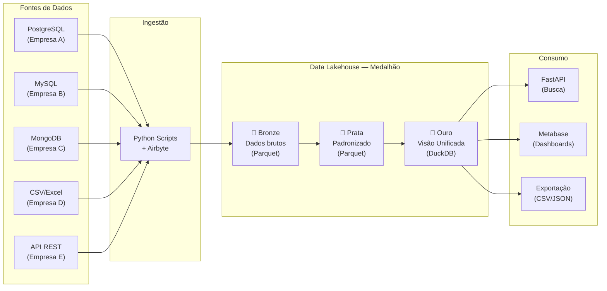

# UniCad — Plataforma Unificada de Cadastros para Holdings

> **Disciplina:** Engenharia de Dados — CEUB  
> **Avaliação:** 1ª Avaliação — Planejamento e Desenho Arquitetural  
> **Data de apresentação:** 30/04/2026

---

## Visão Geral

O **UniCad** é um projeto de engenharia de dados que resolve um problema comum em grandes holdings: a **fragmentação de cadastros de clientes e fornecedores** espalhados por múltiplos sistemas, bancos de dados e estruturas diferentes. O projeto propõe uma arquitetura Lakehouse com Arquitetura Medalhão (Bronze/Prata/Ouro), utilizando DuckDB como motor analítico colunar para entregar uma visão consolidada e consultável de todos os cadastros.

## Problema Central

Uma holding que administra diversas empresas enfrenta a impossibilidade de responder perguntas simples como:

- Quantos clientes únicos temos no grupo?
- Quem são nossos maiores fornecedores considerando todas as subsidiárias?
- Como enviar uma comunicação unificada para toda a base?

Cada subsidiária utiliza sistemas diferentes (PostgreSQL, MySQL, MongoDB, planilhas), com schemas heterogêneos — uma empresa registra endereço, outra registra redes sociais, outra apenas telefone. A unificação desses dados em um banco relacional tradicional geraria tabelas com centenas de colunas majoritariamente vazias. O UniCad resolve isso com armazenamento colunar (DuckDB + Parquet), que lida eficientemente com dados esparsos.

## Estrutura da Documentação

| Seção | Documento | Descrição |
|-------|-----------|-----------|
| 4.1 | [Descrição do Projeto](docs/01-descricao-projeto.md) | Contexto de negócio, problema, objetivos e stakeholders |
| 4.2 | [Definição e Classificação dos Dados](docs/02-definicao-classificacao-dados.md) | Fontes, formatos, volumes, dados batch vs streaming |
| 4.3 | [Domínios e Serviços](docs/03-dominios-servicos.md) | Domínios de negócio, serviços e responsabilidades |
| 4.4 | [Arquitetura — Fluxo de Dados](docs/04-arquitetura.md) | Diagrama ponta a ponta, justificativa arquitetural, trade-offs |
| 4.5 | [Tecnologias](docs/05-tecnologias.md) | Stack tecnológico detalhado e justificado por etapa |
| 4.6 | [Considerações Finais](docs/06-consideracoes-finais.md) | Riscos, limitações e próximos passos para a Parte 2 |

## Stack Tecnológico Resumida

```
Ingestão:       Python + conectores nativos / Airbyte (CDC)
Armazenamento:  MinIO (Object Storage) + DuckDB (motor analítico)
Formato:        Apache Parquet
Transformação:  dbt-duckdb
Orquestração:   Apache Airflow
Servir Dados:   FastAPI (busca) + Metabase (dashboards)
```

## Arquitetura em Alto Nível



## Como Navegar

1. Comece pela [Descrição do Projeto](docs/01-descricao-projeto.md) para entender o contexto
2. Siga a ordem numérica dos documentos na pasta `docs/`
3. Cada documento contém diagramas Mermaid renderizáveis diretamente no GitHub
